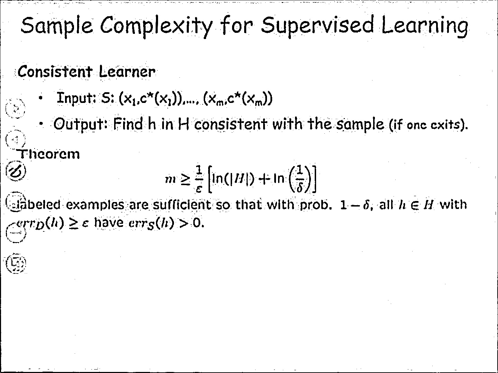
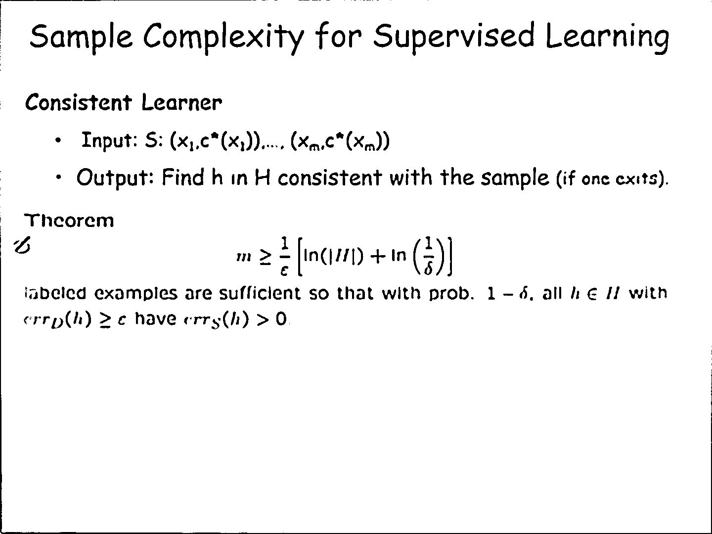
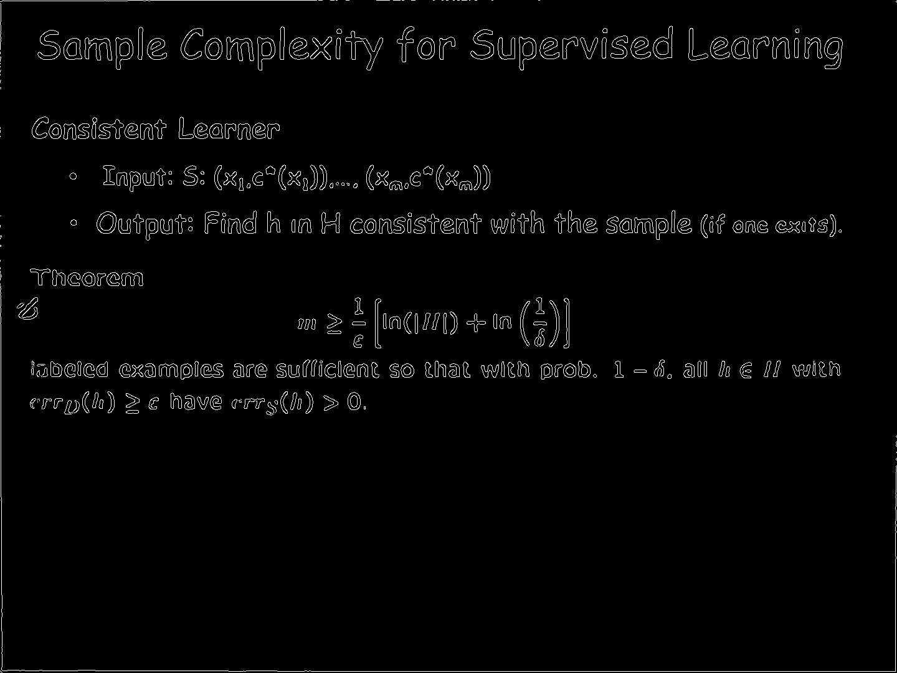

# Slide-matching-from-a-video
Tool for matching some images of slides from a video to soft copies of the respective slides

**Techniques used:** Normalised correlation with denoising, adaptive thresholding and
edge detection 

**Libraries used:** ​sys, cv2, numpy, os

## Procedure
After rigorous experimentation we have come up with the following method for matching
the frames with the slides.
1. First, we read all the frames and slides and store them in respective dictionaries
for saving further computation.
2. Before storing the images, we filter them using fastNlMeansDenoising method,
after that we quantised the images using adaptive thresholding to enhance the
text of the images.
3. Finally we calculate the edges so that only the text part is white and rest of the
background is black.
4. The above steps set up the images for taking the normalised cross correlation.
5. We iterate over all slides for a given frame and calculate the correlation with each
of them, the slide for which the maximum value obtained is given as output.

**Accuracy on given dataset: 95.3%**

### Image after applying ​adaptive thresholding ​(gaussian)

cv2.adaptiveThreshold function was used for this purpose

### Image after ​denoising ​ in addition to adaptive thresholding

cv2.fastNlMeansDenoising function was used for this purpose.

### Image after using ​edge detection

cv2.Canny function was used for this purpose.
